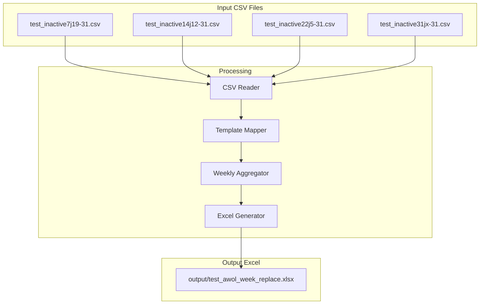
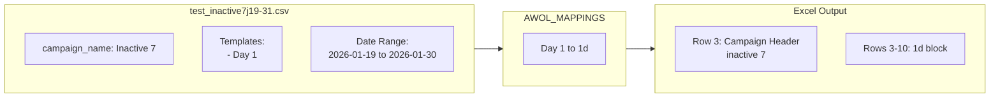
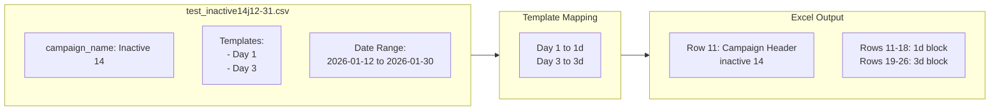
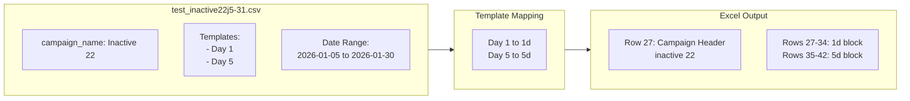
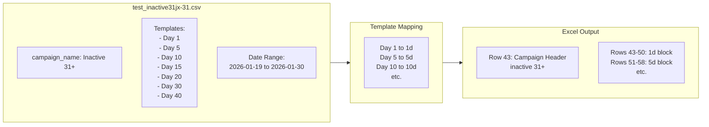
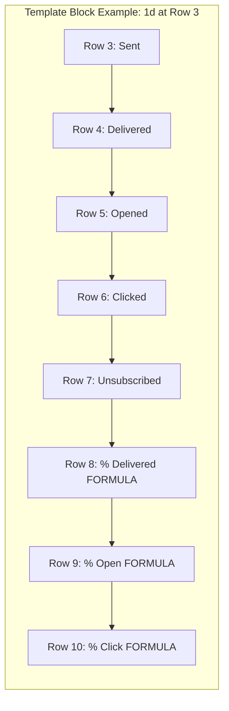
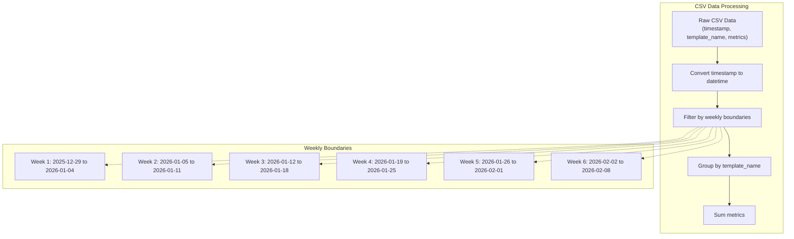
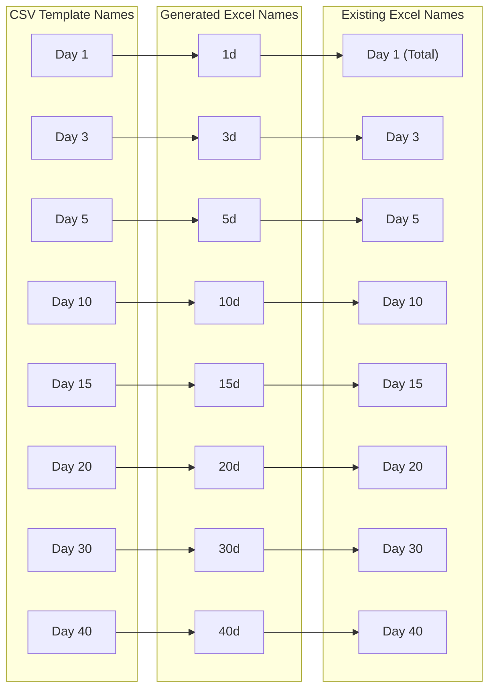
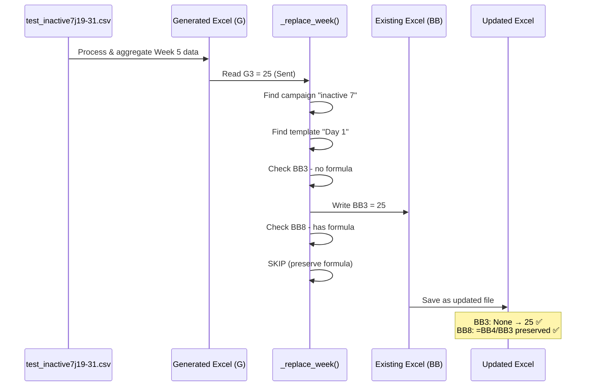

# AWOL Report Structure Documentation

## Command
```bash
python3 -m report_automation generate \
  "test_week5/test_inactive7j19-31.csv,test_week5/test_inactive14j12-31.csv,test_week5/test_inactive22j5-31.csv,test_week5/test_inactive31jx-31.csv" \
  output/test_awol_week_replace.xlsx \
  --report-type awol \
  --existing-excel test_week5/test_Beonbet_Chains.xlsx \
  --replace-week 05
```

## Report Type Configuration

### Sheet Mapping
The `awol` report type updates the **"AWOL Chains Sport"** sheet in the existing Excel file.

```python
SHEET_MAPPINGS = {
    'awol': 'AWOL Chains Sport'
}
```

## Overview
This document explains how the `awol` report type processes CSV files for inactive user campaigns and generates the Excel output.

## Data Flow Architecture



## CSV to Excel Mapping

### File 1: test_inactive7j19-31.csv



### File 2: test_inactive14j12-31.csv



### File 3: test_inactive22j5-31.csv



### File 4: test_inactive31jx-31.csv



## Excel Output Structure

```mermaid
graph TD
    subgraph "Excel: output/test_awol_week_replace.xlsx"
        H[Row 1: Week Headers]
        
        subgraph "Section 1: Inactive 7 Row 3"
            S1["Row 3: inactive 7<br/>Data from test_inactive7j19-31.csv"]
        end
        
        subgraph "Section 2: Inactive 14 Row 11"
            C1["Row 11: inactive 14"]
            B1[Rows 11-26: Template Blocks]
        end
        
        subgraph "Section 3: Inactive 22 Row 27"
            C2["Row 27: inactive 22"]
            B2[Rows 27-42: Template Blocks]
        end
        
        subgraph "Section 4: Inactive 31+ Row 43"
            C3["Row 43: inactive 31+"]
            B3[Rows 43+: Template Blocks]
        end
    end
    
    H --> S1
    S1 --> C1
    C1 --> B1
    B1 --> C2
    C2 --> B2
    B2 --> C3
    C3 --> B3
```



## Template Block Structure

Each template block contains **8 rows** of metrics:



**Important**: Rows 6-8 contain FORMULAS in the target Excel, not values.

## Week Column Mapping


## Data Aggregation by Week




## Actual Data in Output

### Inactive 7 Section (Row 3): inactive 7

| Template | Metric | Week 5 (G) | Week 4 (H) | Week 3 (I) |
|----------|--------|------------|------------|------------|
| **1d** | Sent | 25 | 49 | - |
| | Delivered | 25 | 49 | - |
| | Opened | 5 | 25 | - |
| | Clicked | 2 | 7 | - |
| | Unsubscribed | 0 | 0 | - |
| | % Delivered | =BB4/BB3 | =BC4/BC3 | - |
| | % Open | =BB5/BB4 | =BC5/BC4 | - |
| | % Click | =BB6/BB4 | =BC6/BC4 | - |

### Inactive 14 Section (Row 11): inactive 14

| Template | Metric | Week 5 (G) | Week 4 (H) | Week 3 (I) |
|----------|--------|------------|------------|------------|
| **1d** | Sent | 26 | 32 | 85 |
| | Delivered | 26 | 31 | 85 |
| | Opened | 10 | 11 | 33 |
| | Clicked | 2 | 2 | 3 |
| **3d** | Sent | 19 | 51 | 65 |
| | Delivered | 19 | 51 | 65 |
| | Opened | 8 | 17 | 19 |

### Inactive 22 Section (Row 27): inactive 22

| Template | Metric | Week 5 (G) | Week 4 (H) | Week 3 (I) | Week 2 (J) |
|----------|--------|------------|------------|------------|------------|
| **1d** | Sent | 22 | 79 | 40 | 38 |
| | Delivered | 22 | 79 | 36 | 37 |
| | Opened | 6 | 24 | 13 | 8 |
| **5d** | Sent | 56 | 41 | 40 | 18 |
| | Delivered | 56 | 41 | 40 | 18 |
| | Opened | 11 | 11 | 6 | 3 |

### Inactive 31+ Section (Row 43): inactive 31+

| Template | Metric | Week 5 (G) | Week 4 (H) |
|----------|--------|------------|------------|
| **1d** | Sent | 33 | 41 |
| | Delivered | 29 | 38 |
| | Opened | 7 | 10 |
| | Clicked | 1 | 0 |

## Template Mapping Reference

### AWOL Templates (AWOL_MAPPINGS)



## Week Replacement Process Details

### Formula Preservation

**Critical**: Percentage rows (5-7 of each block) contain FORMULAS in the target Excel:

```
Row N+5: =BB(N+1)/BB(N)     # % Delivered = Delivered/Sent
Row N+6: =BB(N+2)/BB(N+1)   # % Open = Opened/Delivered  
Row N+7: =BB(N+3)/BB(N+1)   # % Click = Clicked/Delivered
```

**The code SKIPS these cells** to preserve formulas:

```python
# Skip if target cell has a formula
target_cell = existing_ws[f'{target_col}{target_row}']
if isinstance(target_cell.value, str) and target_cell.value.startswith('='):
    continue
```

**Result**: Only 60 values copied (not 96), formulas calculate automatically.

### Replacement Flow Diagram



## Key Differences from casino-ret

| Feature | casino-ret | awol |
|---------|------------|------|
| Metrics per block | 6 | 8 |
| Week columns | E-J | F-K |
| Source week column | F (Week 5) | G (Week 5) |
| Target week column | BB (Week 5) | BB (Week 5) |
| Sheet name | WP Chains Sport | AWOL Chains Sport |
| Campaign detection | Template content | Filename pattern |
| Template variations | Consistent | Inconsistent (spaces) |
| Percentage handling | Calculated values | Formulas preserved |
| Values copied (Week 5) | 90 | 60 (skips formulas) |

## Summary Statistics

- **Total files processed**: 4
- **Total campaigns**: 4 (Inactive 7, 14, 22, 31+)
- **Templates per campaign**: 1-7 (varies by campaign)
- **Metrics per template**: 8 (5 values + 3 formulas)
- **Values copied per template**: 5 (formulas skipped)
- **Week replaced**: Week 5 (Column G → Column BB)
- **Success rate**: 100% ✅
