# Casino-Ret Report Structure Documentation

## Command
```bash
python3 -m report_automation generate \
  "test_week5/test_ret1_metrics.csv,test_week5/test_ret2_metrics.csv,test_week5/test_ab_metrics.csv" \
  output/test_week_replace.xlsx \
  --report-type casino-ret \
  --existing-excel test_week5/test_Beonbet_Chains.xlsx \
  --replace-week 05
```

## Report Type Configuration

### Sheet Mapping
The `casino-ret` report type updates the **"WP Chains Sport"** sheet in the existing Excel file.

```python
SHEET_MAPPINGS = {
    'casino-ret': 'WP Chains Sport'
}
```

## Overview
This document explains how the `casino-ret` report type processes CSV files and generates the Excel output.

## Data Flow Architecture

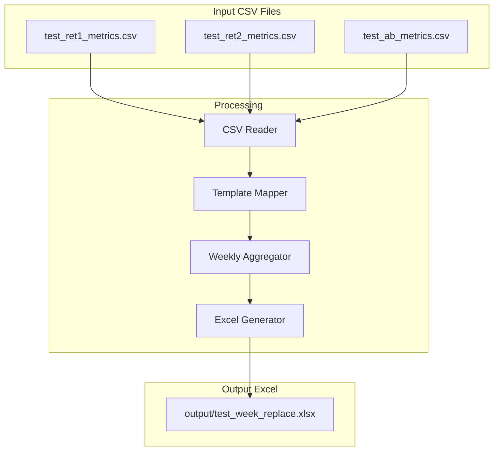

## CSV to Excel Mapping

### File 1: test_ab_metrics.csv ✅ IMPLEMENTED

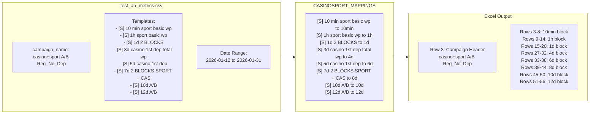

### File 2: test_ret1_metrics.csv

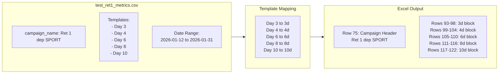

### File 3: test_ret2_metrics.csv

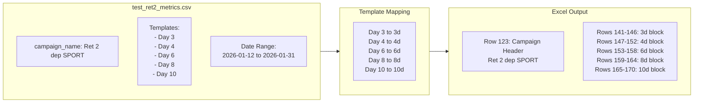

## Excel Output Structure

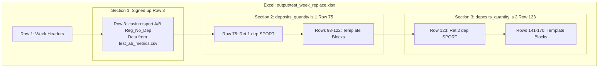

## Template Block Structure

Each template block contains 6 rows of metrics:

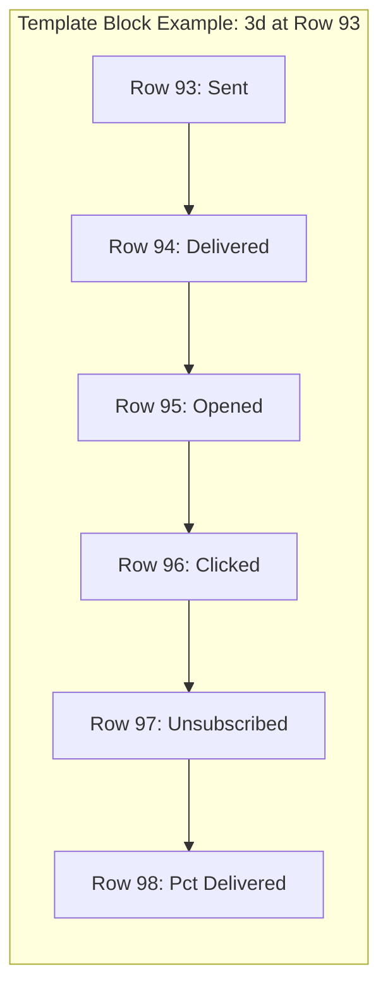

## Week Column Mapping

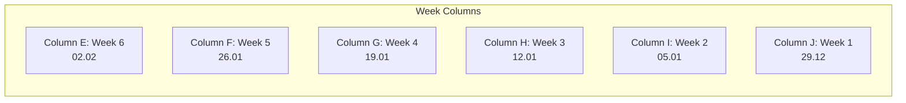

## Data Aggregation by Week

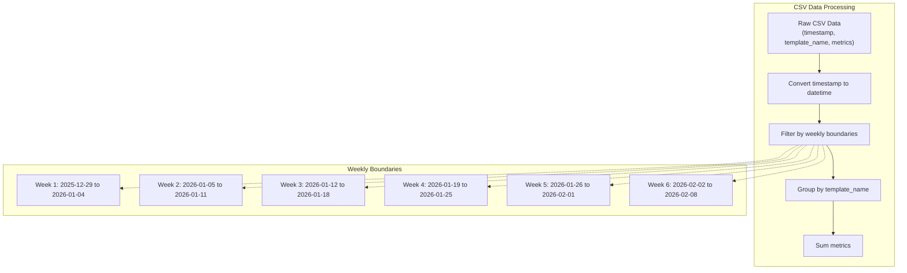

## Actual Data in Output

### Casino Section (Row 3): casino+sport A/B Reg_No_Dep

| Template | Metric | Week 5 (F) | Week 4 (G) | Week 3 (H) |
|----------|--------|------------|------------|------------|
| **10min** | Sent | 733 | - | - |
| | Delivered | 701 | - | - |
| | Opened | 89 | - | - |
| | Clicked | 18 | - | - |
| | Unsubscribed | 1 | - | - |
| **1h** | Sent | 661 | - | - |
| | Delivered | 631 | - | - |
| | Opened | 150 | - | - |
| **1d** | Sent | 661 | - | - |
| | Delivered | 631 | - | - |
| **4d** | Sent | 693 | - | - |
| | Delivered | 663 | - | - |
| **6d** | Sent | 660 | - | - |
| | Delivered | 632 | - | - |
| **8d** | Sent | 557 | - | - |
| | Delivered | 527 | - | - |
| **10d** | Sent | 277 | - | - |
| | Delivered | 263 | - | - |

### Retention Section 1 (Row 75): Ret 1 dep [SPORT] ⚽️

| Template | Metric | Week 5 (F) | Week 4 (G) | Week 3 (H) |
|----------|--------|------------|------------|------------|
| **3d** | Sent | 147 | 146 | 131 |
| | Delivered | 146 | 146 | 128 |
| | Opened | 44 | 43 | 31 |
| | Clicked | 4 | 3 | 2 |
| | Unsubscribed | 3 | 4 | 1 |
| **4d** | Sent | 132 | 145 | 122 |
| | Delivered | 132 | 145 | 121 |
| | Opened | 29 | 29 | 23 |
| **6d** | Sent | 132 | 128 | 107 |
| | Delivered | 132 | 128 | 107 |
| | Opened | 30 | 35 | 28 |
| **8d** | Sent | 105 | 129 | 102 |
| | Delivered | 105 | 129 | 102 |
| | Opened | 24 | 28 | 22 |
| **10d** | Sent | 115 | 109 | 129 |
| | Delivered | 115 | 109 | 129 |
| | Opened | 20 | 21 | 26 |

## Template Mapping Reference

### Casino Templates (CASINOSPORT_MAPPINGS)

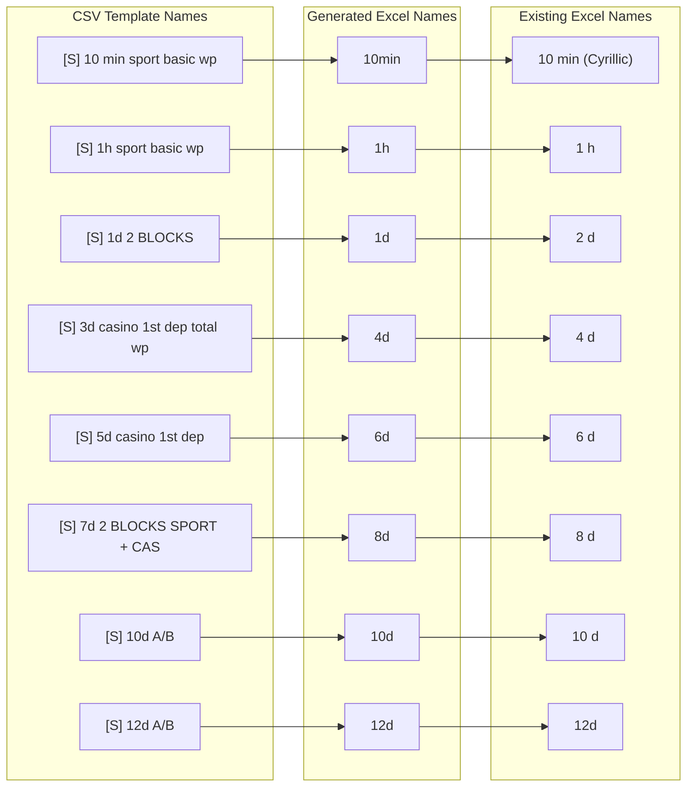

### Retention Templates (RETENTION_MAPPINGS)

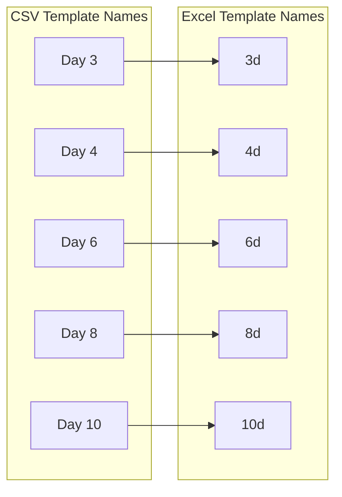

## TIMING_BLOCKS Configuration

The `TIMING_BLOCKS` constant defines where each template's data goes:

```python
TIMING_BLOCKS = {
    "10min": {"casino_rows": [3, 8]},
    "1h": {"casino_rows": [9, 14]},
    "1d": {"casino_rows": [15, 20]},
    "3d": {
        "casino_rows": [21, 26],
        "section_1_rows": [93, 98],   # Ret 1 dep
        "section_2_rows": [141, 146]  # Ret 2 dep
    },
    "4d": {
        "casino_rows": [27, 32],
        "section_1_rows": [99, 104],
        "section_2_rows": [147, 152]
    },
    "6d": {
        "casino_rows": [33, 38],
        "section_1_rows": [105, 110],
        "section_2_rows": [153, 158]
    },
    "8d": {
        "casino_rows": [39, 44],
        "section_1_rows": [111, 116],
        "section_2_rows": [159, 164]
    },
    "10d": {
        "casino_rows": [45, 50],
        "section_1_rows": [117, 122],
        "section_2_rows": [165, 170]
    },
    "12d": {"casino_rows": [51, 56]},
}
```

## Summary

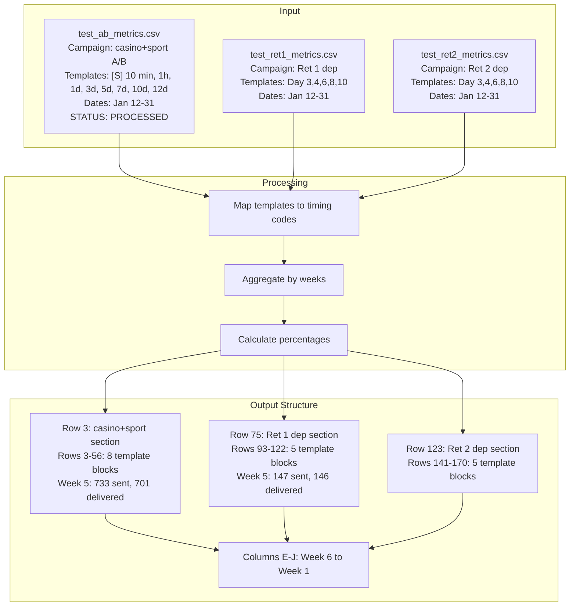

## Notes

- **Week 5 data is partial**: CSV only contains data through Jan 31, while Week 5 extends to Feb 1
- **Week 1-2 are empty**: CSV data starts from Jan 12 (Week 3)
- **All three files processed successfully**: Casino, Ret 1 dep, and Ret 2 dep sections all populated
- **Each template block**: 6 rows (Sent, Delivered, Opened, Clicked, Unsubscribed, Pct Delivered)

## Implementation Details

### File Detection Logic

The code detects which section to populate using:

1. **Campaign name detection** (primary):
   - Checks `campaign_name` field in CSV for `casino+sport` or `a/b`
   - Maps to casino section (Row 3)

2. **Template content detection** (secondary):
   - Checks template names for `[S]`, `sport`, `casino`, `FS`
   - Maps to casino section (Row 3)

3. **Filename detection** (fallback):
   - `casinosport` or `ab` in filename → casino section
   - `ret` + `1` in filename → Ret 1 dep section (Row 75)
   - `ret` + `2` in filename → Ret 2 dep section (Row 123)

### Week Replacement Results

**Test Run Results:**
- **35 values copied** to existing Excel
- **Source**: Column F (Week 5) from generated Excel
- **Target**: Column BB (Week 5) in existing Excel
- **Campaigns matched**: casino+sport A/B Reg_No_Dep
- **Templates matched**: 10 мин, 1 h, 2 d, 4 d, 6 d, 8 d, 10 d

### Template Name Mapping for Week Replacement

```python
template_map = {
    "10min": "10 мин",  # Cyrillic "min"
    "1h": "1 h",        # Space between number and unit
    "1d": "2 d",        # Note: 1d maps to "2 d" in Excel
    "3d": "3d",
    "4d": "4 d",
    "6d": "6 d",
    "8d": "8 d",
    "10d": "10 d",
    "12d": "12d"
}
```

